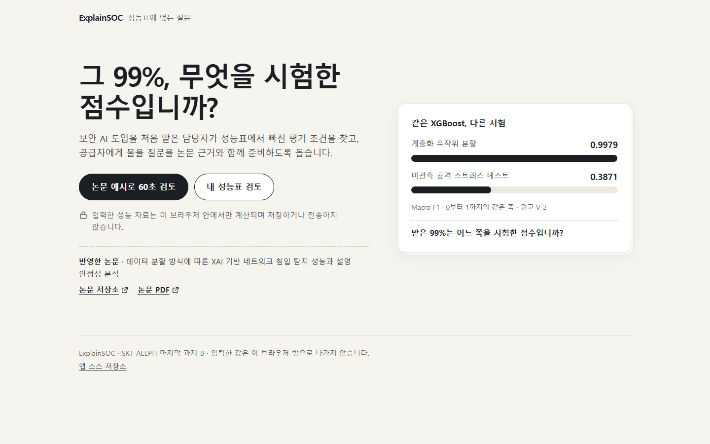
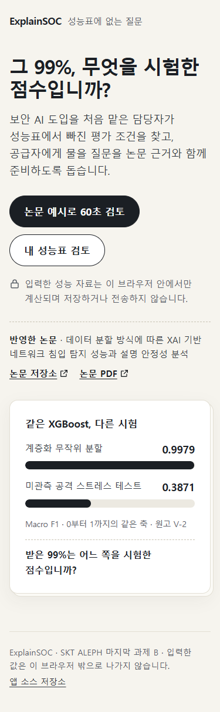
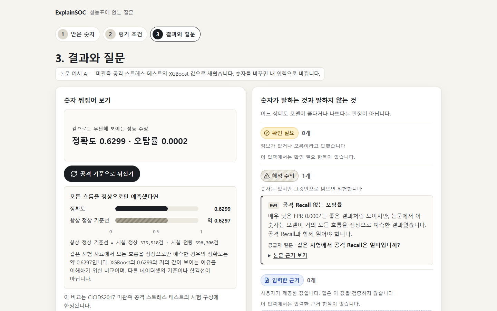
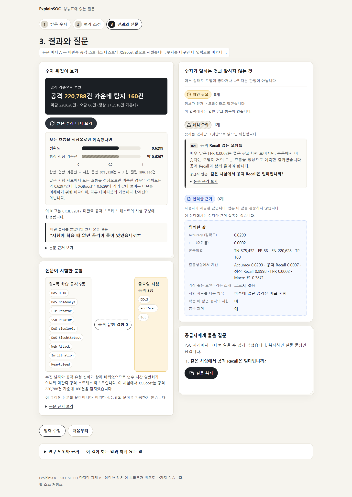
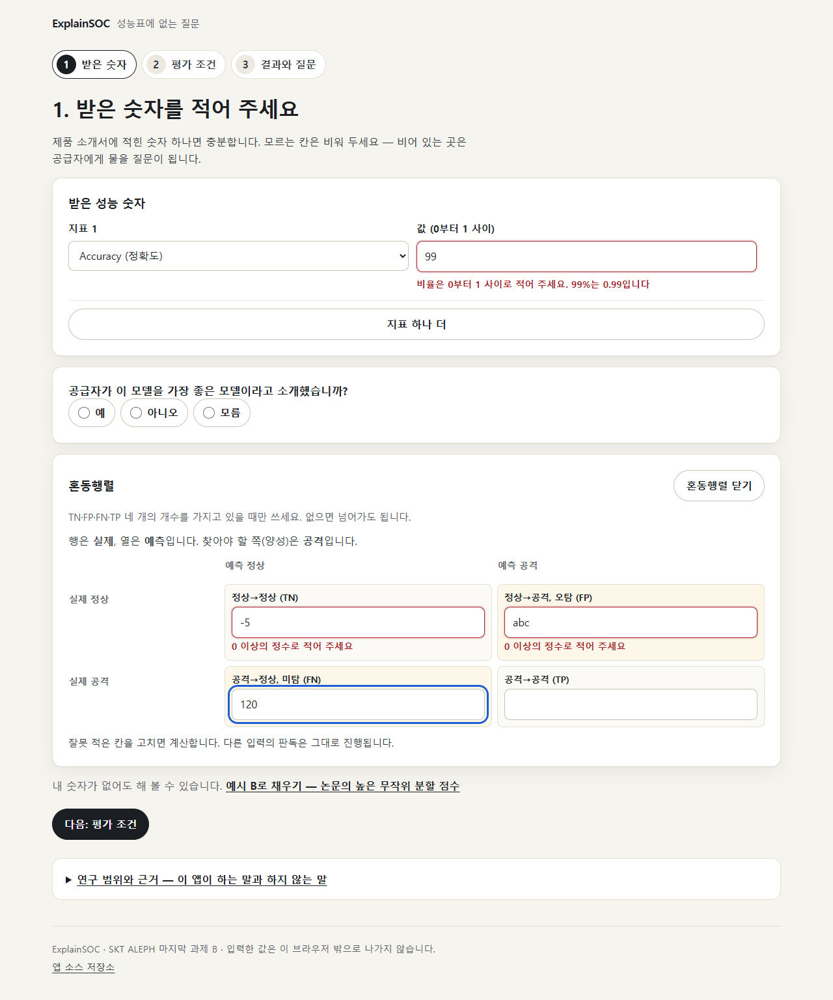

# 카드 2 증거 — 작동하는 첫 흐름

> 통과 기준: BRB-C02 · BRB-C03 · BRB-C04 · BRB-C05
> 기록일: 2026-09-22 · 기록한 사람: Claude(구현 담당)

## 만든 것

설계 21절 "첫 판에 꼭 넣는다" 가운데 카드 2 범위를 한 페이지 단계형 작업대로 만들었다.

| 화면 | 구현 | 코드 |
|---|---|---|
| A 첫 화면 | 제목, 도움 한 문장, 두 버튼, 개인정보 안내, 축약 없는 논문 제목, 새 탭 외부 링크, 같은 XGBoost·다른 시험 그림 | `src/components/Hero.tsx` |
| B 받은 주장 | 지표 선택·값, 지표 하나 더, 가장 좋은 모델 주장, 2×2 혼동행렬(행=실제, 열=예측, 칸마다 한국어), 실시간 계산 | `ClaimStep.tsx`, `MetricInput.tsx`, `ConfusionMatrixInput.tsx` |
| C 평가 조건 | 세 질문, 예 / 아니오 / 모름, 읽기를 강요하지 않는 용어 도움말 | `EvaluationQuestions.tsx` |
| D 주장 뒤집기 | 받은 주장 → 공격 개수로 뒤집기 → 항상 정상 기준선(같은 0~1 축) → 범위 문장 → 먼저 물을 질문 | `ClaimReveal.tsx` |
| E 분할 그림 | 월~목 학습 공격 9종 · 겹침 0 · 금요일 시험 공격 3종, 논문의 분할이라고 밝힘 | `SplitEvidenceFigure.tsx` |
| F 결과와 질문 | 확인 필요 → 해석 주의 → 입력한 근거, 입력한 값, 질문 목록과 복사, 논문 근거 보기 | `FindingList.tsx`, `QuestionList.tsx` |
| G 연구 범위 | 논문 수치, 하는 말 / 하지 않는 말, 한계, P01~P10 원문, 출처 | `ResearchScope.tsx` |

도메인은 화면보다 먼저 순수 함수로 만들었다 — `src/domain/metrics.ts`(계산), `validation.ts`(입력
검증), `reviewRules.ts`(R01~R10), `review.ts`(결과 조립), `form.ts`(폼 → 판독 입력).

## 첫 화면 — BRB-C03

| 데스크톱 1440×900 | 모바일 375×812 |
|---|---|
|  |  |

자동 검사(`tests/component/app.test.tsx` "첫 화면")가 DOM에서 다음을 확인한다.

- h1 `그 99%, 무엇을 시험한 점수입니까?`
- 도움 한 문장 `보안 AI 도입을 처음 맡은 담당자가 … 준비하도록 돕습니다.`
- `반영한 논문 · 데이터 분할 방식에 따른 XAI 기반 네트워크 침입 탐지 성능과 설명 안정성 분석` — 축약 없음
- 외부 링크는 새 탭, 접근 가능한 이름에 `(외부 링크, 새 탭)`

## 세 행동을 직접 해 본 결과 — BRB-C02

| 행동 | 논문 예시 경로 | 내 성능표 경로 |
|---|---|---|
| 1. 숫자 하나 적기 / 예시 선택 | `논문 예시로 60초 검토` → 바로 결과 | 지표 `Accuracy`, 값 `0.99` |
| 2. 세 조건에 답하기 | 예시 값(미관측 공격 스트레스 테스트 / 예 / 예), `입력 수정`으로 바꿀 수 있음 | 키보드로 `무작위` → 화살표로 `모름`, `모름`, `아니오` |
| 3. 말하는 것·말하지 않는 것 확인, 질문 복사 | R04(해석 주의) · 질문 1개 복사 | R02·R09(확인 필요), R03·R06(해석 주의) · 질문 4개 복사 |

두 경로 모두 실제 Chrome에서 끝까지 자동으로 돌렸다(`tests/e2e/flows.spec.ts`). 복사된 글을 클립보드에서
다시 읽어, 질문 문장만 있고 입력한 숫자(`0.99`)는 없음을 확인했다.

## 서명 장면 — 논문 예시 A

| 뒤집기 전 | 뒤집은 뒤 (전체) |
|---|---|
|  |  |

모바일 결과 전체: [`screenshots/f-result-mobile.png`](screenshots/f-result-mobile.png)

1. `정확도 0.6299 · 오탐률 0.0002` — 겉으로는 무난해 보이는 성능 주장
2. `공격 기준으로 뒤집기` → `공격 220,788건 가운데 탐지 160건 · 미탐 220,628건`
3. 같은 0~1 축에서 정확도 0.6299와 항상 정상 기준선 약 0.6297, 계산식 `375,518 ÷ 596,306`
4. `이 비교는 CICIDS2017 미관측 공격 스트레스 테스트의 시험 구성에 한정됩니다.`
5. 먼저 물을 질문 `“시험에 학습 때 없던 공격이 들어 있었습니까?”`
6. 9종 대 3종, 겹침 0
7. 해석 주의 R04 — 원고 V-2의 "매우 낮은 FPR 0.0002" 표현, 질문 `같은 시험에서 공격 Recall은 얼마입니까?`

## 잘못된 입력과 실제 화면 — BRB-C05

| 입력 | 넣은 값 | 화면 | 다른 입력 |
|---|---|---|---|
| 지표 없이 값 | (칸이 닫혀 있음) | 먼저 지표 이름을 골라 주세요 | 영향 없음 |
| 비율 — 글자 | `abc` | 0부터 1 사이의 숫자로 적어 주세요 | 계속 판독 |
| 비율 — 음수 | `-0.2` | 비율은 0보다 작을 수 없습니다 | 계속 판독 |
| 비율 — 1 초과 | `99`, `99%` | 비율은 0부터 1 사이로 적어 주세요. 99%는 0.99입니다 | 계속 판독 |
| 비율 — 무한 | `Infinity`, `NaN` | Infinity나 NaN 대신 0부터 1 사이의 일반 숫자로 적어 주세요 | 계속 판독 |
| 혼동행렬 — 음수·글자 | `-5`, `abc` | 그 칸에만 `0 이상의 정수로 적어 주세요` | 계산만 멈춤 |
| 혼동행렬 — 소수 | `86.0` | 0 이상의 정수로 적어 주세요 | 계산만 멈춤 |
| 혼동행렬 — 쉼표 | `375,432` | 정수로 읽음 | — |
| 혼동행렬 — 안전 정수 초과 | `9007199254740993` | 지원 범위보다 큰 값입니다 | 계산만 멈춤 |
| 혼동행렬 — 합 0 | `0 0 0 0` | 평가한 항목이 없어 지표를 계산할 수 없습니다 | — |
| 혼동행렬 — 공격 표본 0 | `TP+FN=0` | 공격 Recall: 공격 표본이 없어 계산할 수 없습니다 | 나머지 지표는 계산 |
| 평가 조건 — 고르지 않음 | — | 모름과 같이 읽어 질문을 만든다 | — |

표의 문구는 `tests/unit/validation.test.ts`가 입력 하나하나로, 브라우저 테스트가 실제 화면으로 확인한다.
잘못 적은 값은 0으로 바꾸지 않고 계산에서 빼며, 결과 화면에 `잘못 적은 칸 N개는 계산에서 뺐습니다`로
알린다. 모든 입력을 비워도 질문 3개(R02·R07·R09)가 나온다
([`screenshots/f-result-all-unknown.png`](screenshots/f-result-all-unknown.png)).

## 60초 측정

| 측정 | 결과 |
|---|---|
| 자동 조작 — 첫 화면 → 예시 → 뒤집기 → 질문 복사 | 0.5초 (Chrome 152, `flows.spec.ts` 서명 장면 시험의 기록값) |
| 사람이 읽으며 쓰는 시간 | **아직 재지 않았다.** 사람이 직접 해야 하므로 카드 5에서 처음 보는 동료가 써 볼 때 함께 잰다 |

자동 조작 시간은 화면이 막히지 않는다는 뜻일 뿐, 사람이 60초 안에 이해한다는 증거가 아니다. 설계 5절의
시간표(0~10초 첫 화면 → 60초 질문 복사)를 사람이 따라가는지는 카드 5에서 확인한다.

## 검증

| 검사 | 결과 |
|---|---|
| 단위 테스트 (`tests/unit`) | 59개 통과 — 두 정확 혼동행렬의 V-2 반올림 값 재현, 항상 정상 기준선 0.6297, 0 분모, 입력 검증 전 항목, R01~R10 각각, 금지 판정어 없음, 근거 ID 존재, 금지 표현(원문 인용 제외)과 인용의 부정문 확인 |
| 컴포넌트 테스트 (`tests/component`) | 15개 통과 — label과 오류 연결, 잘못된 입력이 다른 결과를 막지 않음, 예시가 P09 원수치를 넣음, 질문만 복사, 라디오 |
| 브라우저 테스트 (`tests/e2e`) | 20개 통과 — 60초 경로, 세 행동, 모름 경로, 잘못된 입력, 새로 고침 뒤 입력 없음, 375·768·1440 가로 스크롤 없음, 키보드만으로 완주, 모션 감소, axe WCAG 2.2 AA 네 화면 위반 0, 정적 자산 외 요청 0, 콘텐츠 보안 정책, 금지 표현 없음 |
| 타입 검사 | `tsc --noEmit` 통과 |

### 테스트 환경에서 알게 된 것

구현한 PC의 Chrome·Edge에는 브라우저와 서버 사이에서 모든 페이지에 스크립트를 끼워 넣는 프로그램이
동작하고 있었다. 서버가 보낸 HTML은 깨끗했지만(`curl`로 확인) 브라우저가 받은 페이지 맨 앞에는 237KB
인라인 스크립트와 외부 스크립트 두 개가 붙어 있었다. 앱이 보내지 않은 요청과 콘솔 오류가 테스트에
섞여서, 브라우저 테스트는 빌드 결과물(`dist`)을 네트워크 없이 바로 읽어 오고 앱 밖으로 나가는 요청은
막고 기록하도록 바꿨다(`tests/e2e/fixtures.ts`). 끼워 넣어진 스크립트가 밖으로 보내려던 요청은 앱의
콘텐츠 보안 정책(`connect-src 'none'`)에 막혀 실패하고 있었다.

## 구현 중 정한 것

설계 문장이 두 가지로 읽히는 곳은 `planning/IMPLEMENTATION-CHECKLIST.md` 1절에 근거와 함께 적었다.
설계 밖 기능은 넣지 않았다. 결과 화면에 `평가 조건 바꾸기` 버튼을 하나 더 두려다, 단계 표시에서 이미
2단계로 갈 수 있고 설계 6-F에 없는 버튼이라 뺐다.

## 완주 체크리스트

- [x] 첫 화면에 논문 제목과 "누구를 어떻게 돕는가" 한 문장을 두었습니다. — 위 스크린샷과 DOM 검사
- [x] 앱이 논문의 결과를 실제로 쓰고, 잘못된 입력에도 멈추지 않습니다. — R01~R10 단위 테스트, 오류 E2E
