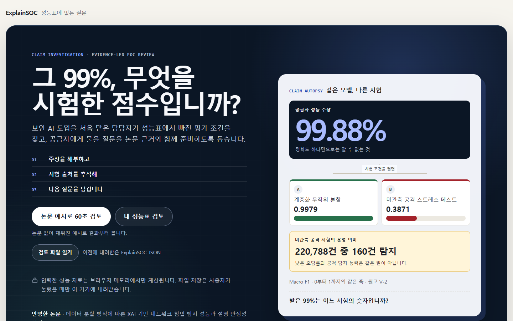
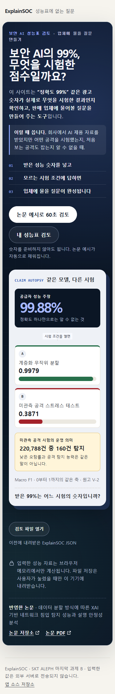

# 카드 4 증거 — 공개와 재현

> **V2 갱신(2026-09-22):** 구현 커밋 `720dc76`, [Actions run 35675622887](https://github.com/myeongjundev/explainsoc/actions/runs/35675622887)
> 검사·배포 성공. 공개본 자산 `index-DDzNqu6T.js`, `index-DY_sn3fI.css`; 공개본 Playwright 22개 통과.
> 현재 실행 묶음은 `explainsoc-720dc76.zip`, SHA-256 `7dc9812c4528ddd47f6354ebcb359686bbd8f81989b14914399c242f213503c5`.
> 세부 기록은 `evidence/card-5.md` 맨 위에 있다.

> 통과 기준: BRB-C08 · BRB-C09 · BRB-C22. BRB-C15는 이 앱의 주소와 앱이 여는 링크를 확인했고,
> 제출할 URL 전체는 카드 5에서 다시 연다.
> 기록일: 2026-09-22 · 기록한 사람: Claude(구현 담당)

## 공개 주소

**https://myeongjundev.github.io/explainsoc/**

| 항목 | 값 |
|---|---|
| 배포 방식 | GitHub Actions → GitHub Pages (`.github/workflows/deploy.yml`) |
| Pages 설정 | 빌드 방식 `workflow`, HTTPS 강제 |
| 배포한 커밋 | `665e819` |
| 실행 기록 | [Actions run 35618803117](https://github.com/myeongjundev/explainsoc/actions/runs/35618803117) — 검사 58초, 배포 약 5분, 둘 다 성공 |
| 다음 커밋 | `25d68ce`(테스트 파일 한 줄)도 [run 35620113292](https://github.com/myeongjundev/explainsoc/actions/runs/35620113292)로 검사·배포 성공. 배포본은 그대로다(같은 자산 `index-DDjgzUbz.js`) |

### 검사를 통과한 커밋만 배포한다

배포 작업은 검사 작업이 끝까지 성공해야 시작한다. 아래 단계 중 하나라도 실패하면 공개 주소는 바뀌지 않는다.

| 단계 | 첫 실행 결과 (ubuntu-latest, Node 24.20.0) |
|---|---|
| `npm ci` — npm 캐시 없이 처음부터 | 113개 설치, 취약점 0 |
| 안전 검사 — 소스 | 8개 PASS |
| 단위·컴포넌트 테스트 | 74개 통과 |
| 프로덕션 빌드 | 성공 |
| 안전 검사 — 배포본 포함 | 11개 PASS |
| 의존성 감사 (`high` 이상이면 실패) | 0 |
| 브라우저 테스트 — Chrome Headless Shell 153 | 20개 통과 (증거 스크린샷 6개는 건너뜀) |
| Pages 배포 | 성공 |

## 새 시크릿 창에서, 로그인 없이

세 가지 방법으로 확인했다.

### 1. HTTP 응답

```text
GET https://myeongjundev.github.io/explainsoc/    200 text/html · 리디렉션 0회
GET http://myeongjundev.github.io/explainsoc/     301 → https (Strict-Transport-Security max-age=31556952)
    응답 헤더에 WWW-Authenticate · Set-Cookie 없음
GET /explainsoc/assets/index-DDjgzUbz.js           200
GET /explainsoc/assets/index-B84lP8u3.css          200
GET /explainsoc/favicon.svg                        200
GET /explainsoc/third-party-licenses.md            200
```

공개된 `index.html`은 로컬 빌드와 바이트까지 같다(SHA-256 `1a8ebc43…9184e23`). 자산 파일 이름에 내용
해시가 들어 있고 이름이 같으므로, 공개 주소·로컬 빌드·아래 ZIP의 빌드가 같은 결과물이다.

### 2. 브라우저 테스트 20개를 공개 주소에 그대로

```bash
LIVE_URL=https://myeongjundev.github.io/explainsoc/ npx playwright test
```

```text
6 skipped
20 passed (8.6s)
```

- Playwright는 테스트마다 쿠키·저장소·로그인 기록이 없는 새 브라우저 컨텍스트를 연다. 새 시크릿 창과
  같은 조건이다. 브라우저는 이 PC의 Chrome 152.0.7977.84다.
- 통과한 것: 60초 예시 경로, 내 성능표의 세 행동, 모든 조건이 모름인 경로, 예시 B, 잘못된 입력(비율·혼동
  행렬), 새로 고침 뒤 입력 없음, 375·768·1440 폭 가로 스크롤 없음, 키보드만으로 끝까지, 모션 감소, axe
  WCAG 2.2 AA 네 화면, 정적 자산 말고는 요청 0건, 콘텐츠 보안 정책, 금지 표현 없음.
- 이 모드에서 앱 요청은 테스트 도구가 공개 서버에서 받아 온다. 이 PC에는 브라우저에 스크립트를 끼워
  넣는 프로그램이 있어서(카드 2), 브라우저가 직접 받으면 배포되지 않은 코드가 섞인다. 받아 오는 쪽만 바뀌고
  페이지가 받는 바이트는 GitHub Pages가 보낸 그대로다.

### 3. 사람 손으로 60초 경로

Claude 데스크톱 앱의 내장 브라우저에서 공개 주소를 열었다. 사용자의 Chrome과 분리된 브라우저이고
로그인하지 않았다.

| 순서 | 본 것 |
|---|---|
| 첫 화면 | 제목, 도움 한 문장, 반영한 논문 제목, 시작 버튼 둘 |
| 논문 예시로 60초 검토 → 공격 기준으로 뒤집기 | 공격 220,788건 가운데 탐지 160건 · 미탐 220,628건 · 오탐 86건, 정확도 0.6299와 항상 정상 기준선 약 0.6297 |
| 결과 | 해석 주의 1개(R04 공격 Recall 없는 오탐률), 질문 1개 "같은 시험에서 공격 Recall은 얼마입니까?" |
| 질문 복사 | 내장 브라우저는 클립보드 쓰기 권한을 주지 않는다. 앱의 대체 경로가 떴다 — 질문 목록을 선택해 두고 "복사하지 못했습니다. 질문 목록을 선택해 두었으니 직접 복사해 주세요." 권한이 있는 Chrome에서는 브라우저 테스트가 클립보드 내용까지 확인한다. |
| 불러온 자원 | 같은 출처의 JS·CSS 두 개뿐 |
| 끝난 뒤 | 주소 그대로, 쿠키 없음, `sessionStorage` 0개 |

| 데스크톱 1440×900 | 모바일 375×812 |
|---|---|
|  |  |

공개 주소의 결과 화면 모바일 전체: [screenshots/live/f-result-mobile.png](screenshots/live/f-result-mobile.png)

### 앱이 여는 링크도 로그인 없이 열린다

| 링크 | 결과 |
|---|---|
| https://github.com/myeongjundev/explainsoc (앱 소스 저장소) | 200 |
| https://github.com/myeongjundev/explainsoc-research (논문 저장소) | 200 |
| https://github.com/myeongjundev/explainsoc-research/blob/main/output/pdf/T10-research-paper.pdf (논문 PDF) | 200 |

### 공개하고 나서 알게 된 것

**같은 출처를 다른 사이트와 나눠 쓴다.** 공개 주소의 출처는 `https://myeongjundev.github.io`이고, 같은
계정의 다른 Pages 사이트도 같은 출처다. 내장 브라우저의 `localStorage`에는 앱을 열기 전부터 다른 사이트가
남긴 키 하나(`portfolio-theme`)가 있었다. 브라우저 저장소는 출처 단위로 나뉘므로, 이 앱이 입력을 저장소에
남겼다면 같은 계정의 다른 사이트가 그 값을 읽을 수 있었다. 입력을 메모리에만 두는 설계(카드 3)가 여기서
실제로 필요하다. 앱을 끝까지 쓴 뒤에도 저장소에는 그 키 하나뿐이었다.

**틀 안에 넣는 것을 막는 헤더는 걸 수 없다.** GitHub Pages는 응답 헤더를 바꿀 수 없고, 메타 태그로 건
콘텐츠 보안 정책은 `frame-ancestors`를 무시한다. 그래서 다른 사이트가 이 앱을 틀 안에 넣는 것은 막지
못한다. 앱에 로그인·저장·전송·결제가 없어서 틀에 넣어 속여도 얻을 것이 없으므로 받아들였다.

## 실행 묶음(ZIP) — BRB-C08 · BRB-C22

> **제출할 최종 묶음은 카드 5에서 바뀌었다.** 전체 제출물 실명 검사(BRB-C12)로 데이터셋 인용을 고쳐
> `explainsoc-2e7bd73.zip`, MIT 라이선스를 넣어 `explainsoc-2e00f55.zip`, README에 트러블슈팅 기록 링크를 넣어
> `explainsoc-9d71d39.zip`이 됐다. 최종 묶음의 해시와 새 임시 폴더 기록은 `evidence/card-5.md`에 있다.
> 아래는 카드 4 시점의 기록이다.

| 항목 | 값 |
|---|---|
| 파일 이름 | `explainsoc-25d68ce.zip` |
| SHA-256 | `6986d64ca828676226a9af0ad25c4f683f2ef1d10dd12e064dc8a183d3585134` |
| 크기 | 103,567 bytes |
| 원본 커밋 | `25d68ce865775b44861174c0761934297c38e164` |
| 비밀번호 | 없음 — 암호화 표시가 켜진 항목 0개 |
| 만든 명령 | `npm run release:zip` (`scripts/make-release-zip.mjs`, 커밋된 허용 목록만 `git archive`) |
| 위치 | 로컬 저장소의 `release/` (`.gitignore`로 막음). 저장소에는 올리지 않는다 |
| 재현 | 같은 커밋에서 두 번 만들어 같은 SHA-256이 나왔다(이 PC, Git 2.53). 줄 끝은 저장소 그대로(LF), 파일 시각은 커밋 시각이다 |

처음에는 배포 커밋 `665e819`로 묶음을 만들어 아래 확인을 모두 했다(SHA-256 `53ad6084…ef89942bd`).
그 뒤 증거를 남기다 묶음에 들어가는 테스트 파일 한 줄(`tests/e2e/evidence.spec.ts`, 공개 주소 스크린샷
폴더)이 바뀌어, 그 줄만 먼저 커밋한 `25d68ce`로 묶음을 다시 만들고 새 임시 폴더에서 같은 확인을
되풀이했다. 제출할 묶음은 `25d68ce`이고, 앱을 이루는 파일은 두 커밋에서 같다(자산 해시 동일).

### 담은 것 — 51개

| 분류 | 파일 |
|---|---|
| 소스 | `src/` 28개, `index.html`, `public/favicon.svg` |
| 설정 | `package.json`, `vite.config.ts`, `tsconfig.json`, `playwright.config.ts`, `.gitignore` |
| lockfile | `package-lock.json` |
| README | `README.md` — 실행 세 줄, 환경 변수 없음, 라이선스 안내 |
| 예시 데이터 | `src/data/paperEvidence.ts`, `src/data/examples.ts` (소스 28개에 포함) |
| 테스트 | `tests/` 12개, `scripts/check-safety.mjs` |
| 묶음 도구 | `scripts/make-release-zip.mjs` |

`.gitignore`를 넣은 이유: README가 "`.env` 파일은 `.gitignore`로 막혀 있습니다"라고 말한다. 묶음을 받아
Git 저장소로 만든 사람에게도 그 말이 참이어야 한다.

### 담지 않은 것 — 풀어서 확인

| 확인 | 결과 |
|---|---|
| `node_modules`, `.git`, `dist`, `release`, 로그, `.env` | 0개 |
| 과제 기록 `planning/`, `evidence/`, CI 설정 `.github/` | 0개 |
| 작업자 PC 경로(`드라이브:\Users\…`, `드라이브:\gov\…`) | 0개 |
| CRLF 줄 끝 | 0개 |

## 새 임시 폴더에서 README대로 — BRB-C09

| 환경 | 값 |
|---|---|
| OS | Windows 11 Home 10.0.26200 |
| Node · npm | v24.15.0 · 11.12.1 |
| 폴더 | 세션 임시 폴더 아래 새로 만든 빈 폴더. 경로에 PC 사용자 이름이 들어 있어 아래에서는 `<새 임시 폴더>`로 적는다 |
| 풀기 | PowerShell `Expand-Archive` → 파일 51개, `node_modules`·`.git`·`dist` 없음 |

```text
<새 임시 폴더>\explainsoc-25d68ce> npm ci
added 113 packages, and audited 114 packages in 3s
found 0 vulnerabilities

<새 임시 폴더>\explainsoc-25d68ce> npm run build
✓ 41 modules transformed.
dist/index.html                   1.22 kB │ gzip:  0.75 kB
dist/third-party-licenses.md      3.42 kB
dist/assets/index-B84lP8u3.css   17.00 kB │ gzip:  4.38 kB
dist/assets/index-DDjgzUbz.js   269.59 kB │ gzip: 83.57 kB
✓ built in 464ms

<새 임시 폴더>\explainsoc-25d68ce> npm run preview
  ➜  Local:   http://127.0.0.1:4173/explainsoc/
```

| 확인 | 결과 |
|---|---|
| `GET http://127.0.0.1:4173/explainsoc/` | 200 text/html, 1,224 bytes |
| JS · CSS · 아이콘 | 200 · 200 · 200 |
| 첫 화면 (내장 브라우저에서 DOM으로 확인) | 제목 "ExplainSOC — 성능표에 없는 질문", h1 "그 99%, 무엇을 시험한 점수입니까?", 도움 한 문장, 반영한 논문 제목, 버튼 "논문 예시로 60초 검토"·"내 성능표 검토". 불러온 스크립트는 앱 JS 하나 |
| 빌드 결과 | 자산 이름(내용 해시)이 공개 주소와 같다 — 묶음이 공개된 것과 같은 앱을 만든다 |

README에 적은 세 줄 말고도 같은 폴더에서 검사를 모두 돌렸다.

| 명령 | 결과 |
|---|---|
| `npm run check` | 파일 목록: 폴더 탐색(Git 저장소가 아님) · 검사한 파일 51개 · 11개 PASS |
| `npm test` | 74개 통과 |
| `npm run test:e2e` | 20개 통과 |

`npm ci`가 3초에 끝난 것은 이 PC의 npm 캐시가 차 있어서다. 캐시 없이 처음부터 받는 설치는 위 CI 첫 실행이
확인했다("npm cache is not found" → 113개 설치).

## 이 카드에서 바꾼 것

| 파일 | 바꾼 것 |
|---|---|
| `.github/workflows/deploy.yml` | 새로 만듦 — 검사 → 배포 |
| `scripts/make-release-zip.mjs`, `npm run release:zip` | 새로 만듦 — 허용 목록 ZIP과 SHA-256 |
| `scripts/check-safety.mjs` | Git 기록이 없는 폴더(풀어 놓은 ZIP)에서도 돈다. 사용자 폴더 경로 검사를 더했다(10개 → 11개) |
| `vite.config.ts` | 번들에 묶인 의존성의 라이선스 전문을 `third-party-licenses.md`로 함께 낸다. 번들은 주석을 지워서 React의 MIT 고지가 배포본에 없었다 |
| `playwright.config.ts`, `tests/e2e/fixtures.ts` | `LIVE_URL`을 주면 같은 테스트를 공개 주소에 돌린다 |
| `tests/e2e/evidence.spec.ts` | 공개 주소 스크린샷은 `screenshots/live`에 따로 둔다 |
| `package.json` `engines` | `>=20.19` → `^22.22.2 \|\| ^24.15.0 \|\| >=26.0.0`. vitest 5.0.1과 jsdom 30.1.0이 요구하는 범위다. 전에 적힌 20.19에서는 테스트가 돌지 않는다. README도 같이 고쳤다 |
| `README.md` | 공개 주소, Node 버전, 실행 묶음, `npm run check`·`npm run verify`, `LIVE_URL`, 서드파티 라이선스 |
| `evidence/card-3.md` | 검사기 시험에 쓴 가짜 이메일·전화번호를 문서에 그대로 적어 두어 `npm run check`가 그 문서를 잡았다. 검사기를 느슨하게 하지 않고 표기를 바꿨다 |

## 남은 위험

- **소스 코드 라이선스는 사용자가 정한다.** 지금은 README에 "아직 정하지 않았습니다. 따로 표시하기 전까지
  모든 권리는 저작자에게 있습니다"라고 적혀 있고, 사용자의 다른 저장소들도 LICENSE 파일이 없다. 정하면
  LICENSE를 넣고 ZIP을 다시 만든다. ZIP 해시가 바뀌므로 이 문서의 표도 고친다.
  → 2026-09-22 사용자가 MIT로 정했다(`2e00f55`). 새 묶음은 `evidence/card-5.md`에 있다.
- **ZIP은 커밋에 묶인다.** 허용 목록 안의 파일(README, 소스, 테스트)이 바뀌면 ZIP을 다시 만들어야 한다.
  `evidence/`·`planning/`만 바뀌는 커밋은 ZIP 내용을 바꾸지 않는다.
- **공개 주소는 최대 10분 늦게 바뀔 수 있다.** GitHub Pages가 `Cache-Control: max-age=600`을 보낸다.
- 사람이 잰 60초와 처음 보는 동료의 사용은 카드 5에서 받는다.

## 검증

| 검사 | 결과 |
|---|---|
| `npm run verify` (로컬) | 안전 검사 11개 PASS · 단위·컴포넌트 74개 · 빌드 · 브라우저 20개 |
| CI 첫 실행 | 모두 성공, 배포 성공 |
| 공개 주소 브라우저 테스트 | 20개 통과 |
| 새 임시 폴더 | `npm ci` · `npm run build` · `npm run preview` 200 · 첫 화면 · 검사 11개 · 74개 · 20개 |
| 의존성 감사 | 0 (전체, 운영 의존성만 둘 다) |

## 완주 체크리스트

- [x] 새 시크릿 창 또는 새 임시 폴더에서 열리는 것을 확인했습니다. — 둘 다 확인했다
