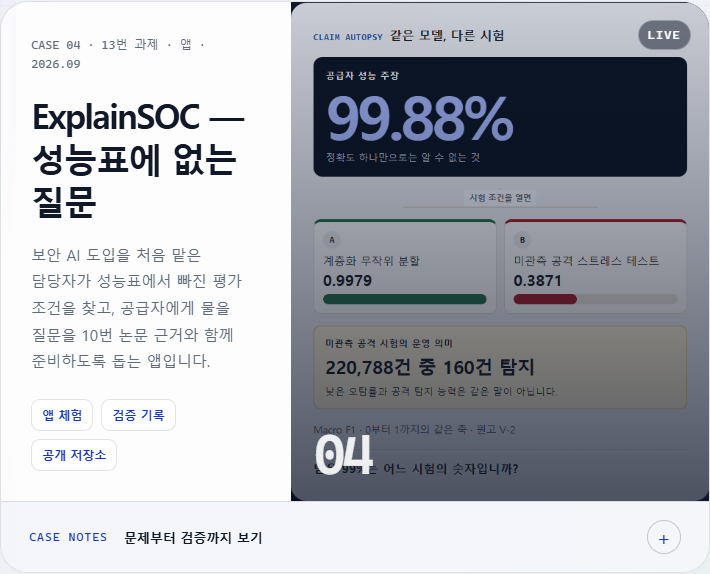
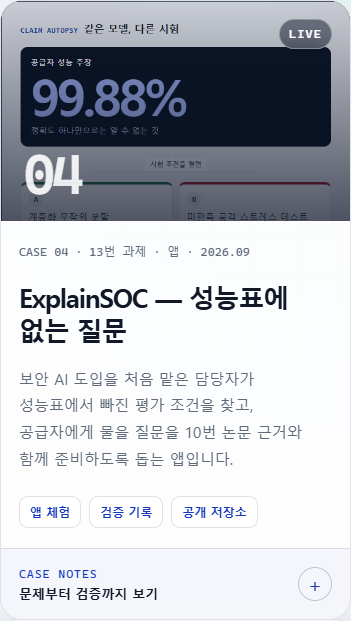
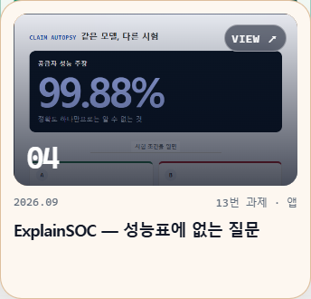

# 카드 5 증거 — 포트폴리오와 제출

## V3 제출본 갱신 — 2026-09-22

> 이 섹션이 아래 V1·V2 기록의 실행 묶음·검증 값을 대체한다. 아래 내용은 당시의 이력으로 남겨 둔다.

| 항목 | V3 제출본 |
|---|---|
| 구현 커밋 | `679add3c250b36545b319a80f9f55c847e56b1ba` |
| 배포 | [GitHub Actions run 35698164859](https://github.com/myeongjundev/explainsoc/actions/runs/35698164859) 검사·Pages 성공 |
| 공개 주소 | https://myeongjundev.github.io/explainsoc/ |
| 실행 묶음 | `explainsoc-679add3.zip` · 130,786 bytes · 61개 파일 |
| SHA-256 | `80650a6729c912dadd071adb87384d59e253660a82d4296cefa0a0503ecffdbd` |
| 재현 | 같은 커밋으로 두 번 생성한 SHA-256 일치 |
| 빈 폴더 검증 | 저장소 밖 새 임시 폴더에서 `npm ci`, 프로덕션 빌드, 안전 검사 11개, Vitest 91개, Playwright 24개 통과(증거 캡처 9개 제외) |
| 공개본 검증 | JS `index--yn4oNyf.js`, CSS `index-D1Vo0e1F.css` 로컬 빌드와 SHA-256 일치 · Playwright 24개 통과 |

V3는 최초 주장과 후속 공급자 답변을 회차로 비교하고, 같은 시험 여부 R14, JSON 저장·열기,
공급자 자료 요청서, 회차 요약 검토표를 포함한다. 제출할 ZIP은 V1·V2 묶음이 아니라
**`explainsoc-679add3.zip`**이다. 독립 리뷰 R1~R5와 작은 결함 L1~L3까지 반영해 별도 시험을
해결로 표시하지 않고, 회차별 답변 메모와 사람이 읽는 근거 풀이를 보존한다.

> 통과 기준: BRB-C10 · BRB-C11 · BRB-C12 · BRB-C13 · BRB-C14 · BRB-C15 · BRB-C22
> 기록일: 2026-09-22 · 기록한 사람: Claude(구현 담당)
>
> **사용자가 채울 곳이 세 군데 남아 있다.** 처음 보는 동료의 사용 결과와 이름 없는 한 줄(BRB-C11),
> 사람이 잰 60초, 제출문의 `② 내가 직접 판단한 일`(BRB-C14). Claude는 이 셋을 지어내지 않고 비워 둔다.

## 12번 사이트 대표작 자리 — BRB-C10

**https://myeongjundev.github.io/about/#work-t13-app**

| 항목 | 값 |
|---|---|
| 저장소·커밋 | `myeongjundev/about` [`1dbbbfc`](https://github.com/myeongjundev/about/commit/1dbbbfc) (연결), [`ea77b4e`](https://github.com/myeongjundev/about/commit/ea77b4e) (검증 칸 테스트 수) — 제출본 `a413189` 뒤의 제출 뒤 갱신 |
| 바꾼 것 | `content/approved.json`의 `t13-app`을 `planned` → `published`. 예정일을 빼고 이름·한 문장·사례 노트 넷·그림·링크 셋을 채웠다 |
| 이름 | ExplainSOC — 성능표에 없는 질문 |
| 한 문장 | 보안 AI 도입을 처음 맡은 담당자가 성능표에서 빠진 평가 조건을 찾고, 공급자에게 물을 질문을 10번 논문 근거와 함께 준비하도록 돕는 앱입니다. |
| 링크 | 앱 체험 (공개 주소) · 검증 기록 (`evidence/card-4.md`) · 공개 저장소 |
| 그림 | `docs/assets/t13-claim-flip.webp` 900×1200 — 공개 주소에서 찍은 "숫자 뒤집어 보기" 칸 |

한 문장은 앱 첫 화면의 도움 문장에 "10번 논문"만 더했다. 12번 사이트에서 바로 위 카드가 10번
논문이라 둘이 이어져 읽힌다.

사례 노트 넷은 이 저장소의 증거에 있는 사실만 썼다.

| 칸 | 문장 | 근거 |
|---|---|---|
| 문제 | 10번 논문에서 같은 XGBoost가 무작위 분할에서는 Macro F1 0.9979, 학습에 없던 공격을 시험하면 0.3871이었습니다. 제품 소개서의 성능 숫자 하나로는 무엇을 시험한 점수인지 알 수 없습니다. | 원고 V-2, `evidence/card-1.md` |
| 판단 | 숫자의 좋고 나쁨을 판정하는 대신, 논문 근거 규칙 13개로 빠진 조건과 모순을 찾고 질문·답변·다음 행동이 남는 PoC 검토 작업대로 바꿨습니다. | `planning/DESIGN.md`, `src/domain/reviewRules.ts` |
| 구현 | React·TypeScript·Vite 정적 앱에 평가 근거 지도, 질문별 상태·메모, 회차 비교, JSON 저장·열기, 자료 요청서와 검토표를 연결했습니다. 입력은 브라우저 안에서만 다루고 콘텐츠 보안 정책으로 외부 전송을 막았습니다. | `evidence/card-3.md`, V3 구현 커밋 |
| 검증 | 단위·컴포넌트 테스트 91개와 WCAG 2.2 AA를 포함한 실제 브라우저 테스트 24개를 통과한 커밋만 배포되게 했습니다. 재현 가능한 ZIP을 저장소 밖 빈 폴더에 풀어 설치·빌드·브라우저 검사까지 다시 통과했습니다. | `evidence/card-4.md`, 이 문서 V3 제출본 갱신 |

처음 연결할 때는 74개였고 V1 카드에서 75개로 고쳤다(`ea77b4e`). V3 현재 수치는 91개·24개다.

**그림을 세로로 다시 찍은 이유.** 대표작 칸은 데스크톱에서 세로로 길다(417×500). 처음 넣은 가로
화면(1200×750)은 가운데만 남아 "공격 220,788건 가운데 탐지 160건"이 "운데 탐지 160건"으로 잘렸다.
결과 화면의 왼쪽 칸만 세로 3:4로 다시 찍어, 데스크톱 대표작·모바일 대표작·왼쪽 카드 묶음 세 곳에서 그
문장이 온전히 보이게 했다.

| 데스크톱 대표작 | 모바일 대표작 | 왼쪽 카드 묶음 |
|---|---|---|
|  |  |  |

세 장 모두 공개 주소에서 찍었다(카드 상태 `LIVE`, 종류 줄 `CASE 04 · 13번 과제 · 앱 · 2026.09`).

### 12번 저장소에서 확인한 것

| 검사 | 결과 |
|---|---|
| `python -m unittest device/test_device.py` | 20개 OK |
| `python device/check_repeat.py` | PASS — 반복 결과와 기대 결과가 같다 |
| `python device/validate_release.py --check-urls` | PASS — 새 링크 셋 포함 외부 링크 전부 |
| `python release/build_release.py` | PASS — 임시 경로에 만들었다. 제출한 `release/out/T12-KimMyeongjun.zip`은 덮지 않았다 |
| GitHub Pages 빌드 | 성공. 공개 HTML에 `work-t13-app` 공개 카드, 그림 200 `image/webp`, 왼쪽 카드 `01—08` |

- 12번 테스트에 사례 노트 수가 3·12로 적혀 있어 4·16으로 고쳤다. 13번 카드가 왼쪽 카드와 대표작에
  모두 있는지 보는 줄 둘을 더했다.
- 왼쪽 카드가 7장에서 8장이 됐다. 겹침 간격 검사(마지막 카드 top + 330px ≤ 560px)는 8장까지
  들어간다. 카드 강조색은 6장까지만 있어 7·8번째는 기본 파랑이다. 7번째는 이전부터 그랬다. 12번의
  디자인이라 손대지 않았다.
- 문서 3종(이력서·자기소개서·경력기술서)은 대표작을 읽지 않는다. 다시 만들어 본문(`word/document.xml`)이
  같음을 확인하고, 압축 시각만 다른 DOCX는 원래 파일로 되돌렸다. 13번을 이력서에 넣을지는 사용자가 정한다.

## 처음 보는 동료 한 명 — BRB-C11

**아직 없다.** Claude가 사람을 만날 수 없어 받지 못했다. 지어내지 않는다.

사용자가 할 일:

1. 이 앱을 본 적 없는 사람 한 명에게 **공개 주소만** 보낸다. 무엇을 하는 앱인지 말하지 않는다.
2. 옆에서 보기만 하고 돕지 않는다. 시계를 켠다.
3. 아래 네 가지를 적는다.
4. 끝나면 "이 앱을 한 줄로 말하면?" 또는 "써 보니 어땠어요?"를 묻고, 답을 **이름 없이** 그대로 적는다.
   이름·학교·연락처는 적지 않는다.

```text
날짜: 2026-__-__
기기·브라우저: (예: 휴대폰 크롬)
1분 안에 "누구를 어떻게 돕는 앱인지" 말했나: 예 / 아니오 (__초)
세 행동을 도움 없이 끝냈나: ① 숫자 적기 또는 예시 선택 __ ② 세 질문에 답하기 __ ③ 질문 복사 __
막힌 곳: (없으면 "없음". 있으면 본 그대로)
이름 없는 한 줄: "…"
```

받은 내용을 이 절에 붙이면 BRB-C11과 완료 정의의 "설명 없이 세 행동을 완주"를 지운다. 막힌 곳이 나오면
고치기 전에 설계 범위 안인지 먼저 본다.

## 사람이 잰 60초

**아직 없다.** 자동 측정(카드 2, 예시 경로 0.5초)은 사람이 읽는 시간이 아니다. 동료 시험 때 같이 재면 된다.

```text
첫 화면 → "논문 예시로 60초 검토" → "공격 기준으로 뒤집기" → "질문 복사"까지: __초
"공격 220,788건 가운데 탐지 160건"을 읽고 무슨 뜻인지 말했나: 예 / 아니오
```

## 전체 제출물의 실명·연락처·비밀값 — BRB-C12

| 제출물 | 본 방법 | 결과 |
|---|---|---|
| 공개 주소의 배포본 5개 파일(HTML·JS·CSS·아이콘·라이선스 고지) | 공개 서버에서 받아 비밀값·이메일·휴대전화·주민번호·데이터셋 저자 이름을 찾음 | 0건 |
| 실행 묶음 `explainsoc-679add3.zip` 61개 파일 | 저장소 밖 빈 폴더에 풀어서 `npm run check`(폴더 탐색) + 저자 이름·PC 경로 검색 | 11개 PASS · 0건 |
| 공개 저장소의 모든 파일(과제 기록·증거 포함) | `npm run check` + `git grep`으로 저자 이름, 이니셜+성 표기, 호칭(님·씨 등) 검색 | PASS · 0건 |
| 12번 사이트의 13번 카드 | 문장·그림·링크 확인, 12번 `validate_release` | 다른 사람 이름 없음 · PASS |
| 제출문 초안(이 문서 아래) | 직접 확인 | 다른 사람 이름 없음 |

**걸렸던 것 하나를 고쳤다.** 앱의 연구 범위 화면과 README의 데이터셋 인용에 데이터셋 논문 저자 세 명의
실명이 있었다. 학술 인용이지만 기준은 "제출물 어디에도 본인 이름 외의 다른 사람 실명이 없다"로 예외가
없다. 저자 이름을 빼고 논문을 하나로 가리키는 제목·학회·쪽·연도·DOI(`10.5220/0006639801080116`)를
남겼다. 저자를 포함한 전체 인용은 같은 화면에서 이어지는 10번 논문의 참고문헌 [1]에 있다고 적었다
(`3dd6274`). 인용에 DOI가 있고 이니셜+성 표기가 없는지 단위 테스트로 막았다.

그 테스트의 주석에 막으려는 표기의 예로 실제 저자 이름 둘을 적어 ZIP에 실명이 다시 들어갔다. ZIP을
풀어 검사하다 잡았고, 형식만 보이는 가짜 예("A. B. Surname")로 바꿨다(`2e7bd73`). 지금 저장소 전체에서
저자 이름 검색 결과는 0건이다. 남은 "이니셜+성" 한 건은 이 가짜 예다.

본인 이름은 13번 저장소와 앱 어디에도 없다. 본인 이름은 12번 사이트에만 있다(허용).

## 짧은 확인 방법 — BRB-C13

제출문에 그대로 옮길 수 있게 적었다.

```text
결과물: https://myeongjundev.github.io/explainsoc/ (로그인 없음)
실행 묶음: explainsoc-679add3.zip — README.md "실행"대로 npm ci → npm run build → npm run preview 후
  http://127.0.0.1:4173/explainsoc/ (Node.js 24.15 이상)

어디에 무엇이
- 첫 화면: 제목 "그 99%, 무엇을 시험한 점수입니까?", 누구를 어떻게 돕는지 한 문장, 반영한 논문 제목
- 묶음 안: src/data/paperEvidence.ts(논문 근거 P01~P10과 수치), src/domain/reviewRules.ts(판독 규칙
  R01~R14), tests/(단위·컴포넌트 91개, 브라우저 24개)

세 행동 해 보기
1) "논문 예시로 60초 검토"를 누르거나, "내 성능표 검토"에서 지표 하나(예: 정확도 0.99)를 적는다.
2) 결과에서 "현재 회차 저장 후 다음 답변 받기"를 누르고, 후속 답변에 공격 Recall 0.0007을 적은 뒤
   같은 시험 여부는 모름으로 두고 결과를 본다.
3) 변화 비교에서 해결됨·남음·새로 생김을 보고 같은 시험 여부를 예로 바꿔 R14가 사라지는지 확인한다.
   "작업 파일 저장"으로 JSON을 내려받아 "작업 파일 열기"로 다시 열고, 두 회차가 돌아오는지 확인한다.

무엇이 나오면 통과
- 논문 예시: "공격 220,788건 가운데 탐지 160건"과 공급자 질문 "같은 시험에서 공격 Recall은
  얼마입니까?"가 나온다.
- 정확도 0.99만 적고 모두 모름: 확인 필요 3개, 해석 주의 1개와 질문 4개가 나온다.
- 후속 답변의 같은 시험 여부가 모름이면 R14가 새로 생기고, 예로 바꾸면 사라진다.
- JSON을 다시 열면 숫자·답변 메모·출처와 두 회차가 복원된다. 앱이 자동 저장하거나 외부로 보내지는 않는다.
- 99를 적으면 멈추지 않고 칸 옆에 "비율은 0부터 1 사이로 적어 주세요. 99%는 0.99입니다"가 나온다.
```

## 제출 목록 — BRB-C22 · BRB-C15

| 무엇 | 값 |
|---|---|
| 결과물 URL | https://myeongjundev.github.io/explainsoc/ |
| 실행 묶음 | `explainsoc-679add3.zip` · 130,786 bytes · 61개 파일 · SHA-256 `80650a6729c912dadd071adb87384d59e253660a82d4296cefa0a0503ecffdbd` · 원본 커밋 `679add3c250b36545b319a80f9f55c847e56b1ba` · 로컬 저장소 `release/` |
| 라이선스 | MIT (`LICENSE`, 2026-09-22 사용자 결정). GitHub도 저장소를 MIT로 인식한다 |
| 짧은 확인 방법 | 위 BRB-C13 |
| 제출문 세 줄 | 아래 BRB-C14 — ②는 사용자가 쓴다 |

V1 묶음은 인용·라이선스·README 변경 때마다 갱신했고, V2에서 작업대 기능을 더한 묶음으로 교체했다.
현재 제출물은 V3 구현 커밋으로 만든 **`explainsoc-679add3.zip`**이다. 같은 커밋에서 두 번 만들어 같은
SHA-256이 나왔고, 저장소 밖 새 임시 폴더에서 전체 검사를 다시 통과했다. 다시 만드는 방법은
`planning/HANDOFF-2026-09-22.md` 1-0에 있다.

### 제출할 수 있는 URL — 모두 로그인 없이

| URL | 응답 |
|---|---|
| https://myeongjundev.github.io/explainsoc/ | 200 · 리디렉션 0 · 인증 헤더 0 |
| https://github.com/myeongjundev/explainsoc | 200 · 0 · 0 |
| https://myeongjundev.github.io/about/ (13번 카드 `#work-t13-app`) | 200 · 0 · 0 |
| https://github.com/myeongjundev/explainsoc/blob/main/evidence/card-4.md | 200 · 0 · 0 |
| https://github.com/myeongjundev/explainsoc-research | 200 · 0 · 0 |
| https://github.com/myeongjundev/explainsoc-research/blob/main/output/pdf/T10-research-paper.pdf | 200 · 0 · 0 |
| https://myeongjundev.github.io/explainsoc/third-party-licenses.md | 200 · 0 · 0 |

공개 주소는 새 브라우저 컨텍스트(쿠키·저장소·로그인 없음)에서 브라우저 테스트 24개를 다시 통과했다.
최종 배포본 `index--yn4oNyf.js`와 `index-D1Vo0e1F.css`는 로컬 빌드와 SHA-256이 같다.

### 최종 묶음의 새 임시 폴더 실행

저장소 밖 세션 임시 폴더 아래 빈 폴더에 PowerShell `Expand-Archive`로 풀었다. 아래는 V3 묶음의 결과다.

```text
<새 임시 폴더>\explainsoc-679add3> npm ci
added 113 packages, and audited 114 packages
found 0 vulnerabilities

<새 임시 폴더>\explainsoc-679add3> npm run build
✓ 48 modules transformed.
dist/assets/index-D1Vo0e1F.css
dist/assets/index--yn4oNyf.js

<새 임시 폴더>\explainsoc-679add3> npm run preview
  ➜  Local:   http://127.0.0.1:4173/explainsoc/
```

| 확인 | 결과 |
|---|---|
| 풀린 파일 | 61개(`LICENSE` 포함), `node_modules`·`.git`·`dist` 없음 |
| 자산 이름 | 공개 주소와 같다(`index--yn4oNyf.js`, `index-D1Vo0e1F.css`) |
| `npm run check` | 폴더 탐색 · 61개 파일 · 앱 소스 36개 · 11개 PASS |
| `npm test` | 91개 통과 |
| `npm run test:e2e` | 24개 통과, 증거 캡처 9개 제외 |

## 제출문 세 줄 — BRB-C14

원문은 세 가지를 나눠 적으라고 한다. ①과 ③은 기록에 있는 사실만 초안으로 둔다. **②는 비워 둔다.**

### ① AI에게 맡긴 일 — 사실 초안

- **설계는 Codex에게.** Codex가 과제 원문과 10번 논문을 읽고 카드 1 후보 둘(Evidence Gate,
  SplitLens)을 냈고, 제품 설계(`planning/DESIGN.md` — 60초 핵심 경험, 판독 규칙 R01~R10, 근거
  P01~P10, 검증·배포·증거 계획)를 썼다.
- **의견과 구현은 Claude에게.** Claude가 카드 1 후보 A·B·C와 설계 조건(`planning/CLAUDE-OPINION.md`),
  Codex 두 후보에 대한 답(`planning/CLAUDE-CARD1-ANSWER.md`), Codex 요청문과 페르소나를 썼다. 승인된
  설계대로 앱(React·TypeScript·Vite), 계산·입력 검증·판독 규칙 코드, 테스트 95개(단위·컴포넌트 75,
  브라우저 20), 안전 검사, GitHub Pages 배포, 재현 가능한 실행 묶음, 카드별 증거를 만들고, 12번 사이트
  대표작 자리를 채웠다.

한 줄로 줄이면(초안): 설계는 Codex, 의견·구현·검증·배포·증거 기록은 Claude에게 맡겼다.

### ② 내가 직접 판단한 일

(사용자가 직접 쓴다. 판단한 날짜와 기록은 `planning/STATUS.md`에 있다.)

### ③ AI 제안을 따르지 않은 일 — 사실 후보

기록에 "제안했지만 최종 결과물에 들어가지 않은 것"으로 남은 것이다. 이 가운데 무엇을 "내가 따르지 않은
제안"으로 쓸지는 사용자가 정한다. 모두 2026-09-21 사용자가 승인한 설계에서 정해졌다.

| AI 제안 | 결과 | 기록 |
|---|---|---|
| Claude: 설명 안정성(SHAP Top-5 시드 안정성)을 판독 항목 여섯째로 붙인다 | 첫 판에 넣지 않았다. 주 사용자가 SHAP 정보를 가져온다는 가정이 맞지 않고 첫 흐름이 커진다 | `CLAUDE-OPINION.md` 4절 → `DESIGN.md` 7절 |
| Claude: 10번 저장소 대시보드 네 화면을 앱 안 "근거 보기"로 남긴다 | 첫 판 범위에서 뺐다(나중에 선택) | `CLAUDE-OPINION.md` 5절 → `DESIGN.md` 15절 |
| Codex: 이름 "Evidence Gate" | 쓰지 않았다. Gate는 앱이 모델을 승인·거절하는 것처럼 읽힌다 | `CLAUDE-CARD1-REVIEW.md` → `DESIGN.md` 0절 |
| Codex: SplitLens를 사용자가 분할을 넣는 도구로 만든다 | 입력 도구로 만들지 않고 논문의 실제 분할 그림(학습 9종 대 시험 3종)으로만 넣었다 | `CLAUDE-CARD1-ANSWER.md` → `DESIGN.md` 22절 4 |

구현 단계(카드 1~5)에서 사용자가 AI 제안을 물리친 기록은 없다. 구현은 승인된 설계를 따랐다.

## 이 카드에서 바꾼 것

| 저장소 | 파일 | 바꾼 것 |
|---|---|---|
| explainsoc | `src/data/paperEvidence.ts`, `README.md` | 데이터셋 인용에서 저자 실명을 빼고 DOI로 가리킨다 |
| explainsoc | `tests/unit/evidence.test.ts` | 인용에 DOI가 있고 저자 표기가 없는지 본다(단위·컴포넌트 74 → 75개) |
| explainsoc | `LICENSE`, `package.json`, `README.md`, `scripts/make-release-zip.mjs` | MIT 라이선스, 묶음 허용 목록에 LICENSE (`2e00f55`) |
| explainsoc | `TROUBLESHOOTING.md`, `README.md` | 포트폴리오용 트러블슈팅 기록과 README 첫머리 링크 (`9d71d39`) |
| explainsoc | `planning/HANDOFF-2026-09-22.md` | 학원 PC에서 이어 갈 인계 문서 |
| explainsoc | `evidence/card-5.md`, `evidence/screenshots/t12-*.png` | 이 문서와 12번 화면 세 장 |
| about (12번) | `content/approved.json`, `docs/index.html`, `docs/assets/t13-claim-flip.webp` | 13번 공개 카드 |
| about (12번) | `device/test_device.py`, `planning/STATUS.md` | 사례 노트 수 검사, 제출 뒤 갱신 기록 |
| about (12번) | `content/approved.json`, `docs/index.html` | 검증 칸 테스트 수 74 → 75 (`ea77b4e`) |

## 완주 체크리스트

- [x] 12번 사이트의 대표작 자리에 앱을 연결했습니다. — 공개 주소에서 확인했다
